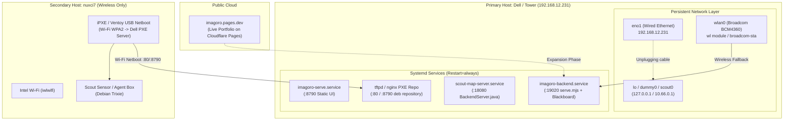
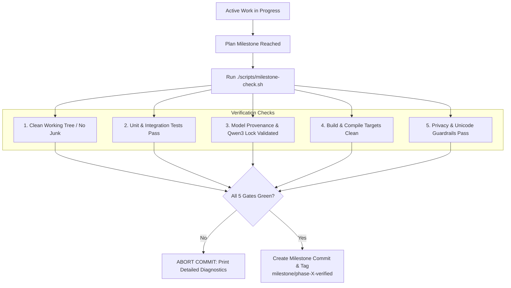

# Rewritten Master Plan: Scout & Imagoro Multi-Host Deployment

> **Version:** 2.0 (Live Hardware & Netboot Reality Baseline)  
> **Date:** September 29, 2026  
> **Target Topology:**  
> - **Public Edge:** Live at `https://imagoro.pages.dev` (Cloudflare Pages)  
> - **Primary Host (Dell / Tower):** `192.168.12.231` (Debian Trixie, PXE boot achieved, GTX 1650, 24 GB RAM, 1 TB SSD, Broadcom BCM4360 Wi-Fi)  
> - **Secondary Host (nuxci7):** Intel NUC i7 (Wireless-only, requires Wi-Fi netboot/PXE or USB-booted netboot)  
> - **Operator Workstations:** Windows Dev Host (`192.168.12.188`), Pop!_OS workstation  

---

## 1. Current State & Strategic Alignment

### 1.1 Reality Check & Revisions
1. **Public Portfolio Status:**  
   The portfolio application is **already live and publicly deployed at `https://imagoro.pages.dev`**. We do not need to re-invent or re-scaffold the basic Pages setup. Future portfolio expansion (interactive live status, showcase routes, public telemetry) will be performed **after** the local hardware and backend services are operational.
2. **Dell Machine (`192.168.12.231` / `scout`):**  
   - Successfully netbooted/PXE-booted with Debian Trixie (kernel `6.12.107+deb13-amd64`).
   - Static Command Center UI is currently served via `imagoro-serve.service` on port `8790`.
   - **Immediate Requirement:** Wire the real functional backend & blackboard (`serve.mjs` / `blackboard.mjs` on port `19020`/`8080`) and the Scout Map Server (`BackendServer.java` on port `18080`) onto this Dell.
   - **Persistence Invariant:** Services must remain completely functional and persistent when the physical Ethernet cable (`eno1`) is unplugged (offline autonomy, dummy/loopback binding, and Broadcom `BCM4360` Wi-Fi failover).
3. **nuxci7 Machine (Intel NUC i7):**  
   - Machine is **not currently LAN wired** (wireless only).
   - Standard UEFI firmware lacks built-in WPA2 Wi-Fi PXE support.
   - **Immediate Requirement:** Implement PXE-over-Wi-Fi via custom iPXE UEFI binary with WPA supplicant, or USB-assisted netboot chainloader fetching payloads from the Dell.

---

## 2. Target Deployment Architecture



---

## 3. Detailed Workstreams & Sequential Roadmap

### Workstream 1: Wire Imagoro Backend & Blackboard onto Dell (High Priority)
- **Files:** [`client/server/serve.mjs`](file:///c:/Users/gryph/kepler/worktrees/imago-recov-5128b/client/server/serve.mjs), [`server/src/blackboard.mjs`](file:///c:/Users/gryph/kepler/worktrees/imago-recov-5128b/server/src/blackboard.mjs), [`server/acl-matrix.json`](file:///c:/Users/gryph/kepler/worktrees/imago-recov-5128b/server/acl-matrix.json).
- **Execution Steps:**
  1. Package and stage `client/server/serve.mjs`, `server/src/`, and `harness/src/guard.mjs` to `/opt/imagoro-backend/` on the Dell via SSH/rsync.
  2. Create systemd unit `/etc/systemd/system/imagoro-backend.service`:
     - `ExecStart=/usr/bin/node /opt/imagoro-backend/client/server/serve.mjs`
     - `Environment=HOST=0.0.0.0 PORT=19020`
     - `Restart=always`, `RestartSec=3s`
  3. Wire Blackboard database/state store with persistent SQLite/JSON or PostgreSQL backend.
  4. Update `/usr/bin/imagoro-serve` or set up Nginx reverse proxy so port `8790` seamlessly proxies `/api/` traffic to `127.0.0.1:19020`.
  5. Verify endpoints: `http://192.168.12.231:19020/api/health`, `/api/snapshot`, and `/api/pipeline/stream`.

---

### Workstream 2: Deploy Scout Map Server onto Dell (High Priority)
- **Files:** [`navigation/backend/BackendServer.java`](file:///c:/Users/gryph/kepler/worktrees/routi-recov-2e852/navigation/backend/BackendServer.java), [`map_server_setup/`](file:///c:/Users/gryph/kepler/worktrees/routi-recov-2e852/map_server_setup), planet vector tiles & PMTiles shards.
- **Execution Steps:**
  1. Sync map engine source and Arizona shard pack onto Dell (`/opt/scout-map-server/`).
  2. Compile Java map server:
     ```bash
     cd /opt/scout-map-server/navigation/backend
     javac BackendServer.java MapModel.java PlanetTileStore.java ProprietaryMapEngine.java ExportMapTextShards.java
     ```
  3. Create systemd unit `/etc/systemd/system/scout-map-server.service`:
     - `ExecStart=/usr/bin/java -Xms2g -Xmx8g dev.warp.stream.BackendServer`
     - `EnvironmentFile=/opt/scout-map-server/stack/config/vehicle_stack.env`
     - `Restart=always`, `RestartSec=5s`
  4. Verify map endpoints:
     - `http://192.168.12.231:18080/api/health`
     - `http://192.168.12.231:18080/api/map/shard`
     - `http://192.168.12.231:18080/api/platform/llm/status`

---

### Workstream 3: Dell Persistence Across Ethernet Disconnection
- **Problem:** When `eno1` (Ethernet) is physically disconnected, default DHCP leases drop, carrier loss causes NetworkManager/systemd-networkd to tear down routes, and services bound to `192.168.12.231` become unreachable.
- **Remediation & Hardening:**
  1. **Interface Agnostic Binding:** Ensure `imagoro-serve`, `imagoro-backend`, and `scout-map-server` explicitly listen on `0.0.0.0` (all IPv4) and `::` (all IPv6), plus local loopback `127.0.0.1`.
  2. **Broadcom BCM4360 Wi-Fi Activation:**
     - The Dell hardware audit confirmed:  
       `03:00.0 Network controller: Broadcom Inc. BCM4360 802.11ac (rev 03)`.
     - Install `broadcom-sta-dkms` and `linux-headers-amd64` to load the `wl` kernel module.
     - Configure NetworkManager / `wpa_supplicant` for automatic Wi-Fi connection to the local access point.
     - When Ethernet is unplugged, NetworkManager automatically preserves active routing via Wi-Fi (`wlan0`).
  3. **Local Loopback / Virtual Dummy Interface (`scout0`):**
     - Configure a persistent local dummy address (`10.66.0.1` or `192.168.12.231/32` on `dummy0`/`lo`) so local inter-process calls and in-chassis containers NEVER stall when external link is down.

---

### Workstream 4: nuxci7 PXE over Wi-Fi & Netboot
- **Challenge:** The Intel NUC i7 has no physical Ethernet wire attached. PC UEFI firmware lacks native 802.11 WPA2 supplicants in ROM.
- **Implementation Strategy:**
  1. **Primary Method: iPXE Wi-Fi EFI Chainloader**
     - Compile custom iPXE binary (`ipxe.efi`) with 802.11 / Wi-Fi drivers and embedded script:
       ```
       #!ipxe
       set net0/ssid <YOUR_SSID>
       set net0/key <YOUR_PASSPHRASE>
       ifopen net0
       dhcp net0
       chain http://192.168.12.231:8790/boot.ipxe
       ```
     - Copy `ipxe.efi` to the EFI partition of a USB drive on the NUC.
     - Power on NUC → Boot from USB → iPXE authenticates to Wi-Fi → chainloads kernel/initrd from Dell!
  2. **Alternative Method: Ventoy Netboot Kernel with Preseeded Wi-Fi**
     - Use the existing Ventoy USB with Debian Trixie installer.
     - Embed `wpasupplicant` configuration and `firmware-iwlwifi` into `initrd.gz`.
     - Installer connects to Wi-Fi during early boot, pulling all `.deb` packages directly from `http://192.168.12.231:8790/`.
  3. **Hardware Bridge Fallback:**
     - If Wi-Fi PXE latency is prohibitive, use a portable Wi-Fi travel router / Ethernet bridge plugged into the NUC's RJ-45 jack.

---

### Workstream 5: Portfolio Expansion at `imagoro.pages.dev`
- **Current State:** Live at `https://imagoro.pages.dev`.
- **Post-Hardware Objectives:**
  - Update Cloudflare Pages content to include system architecture, live operational health telemetry (bridged via Cloudflare Worker or edge proxy), and interactive Command Center block demonstrations.
  - Automate build and deploy pipeline via Cloudflare Wrangler GitHub actions / deploy scripts.

---

## 4. Auto-Approval on Commands & Milestone Commit Verification

### 4.1 Running with Auto-Approval (`agy --dangerously-skip-permissions`)
The Antigravity CLI supports full autonomous execution without manual confirmation prompts:

```bash
# Launch CLI with all tool/command permissions pre-approved:
agy --dangerously-skip-permissions

# Combined with model selection and interactive prompt:
agy --dangerously-skip-permissions --model "gemini-3.8-flash" -i "Proceed with milestone tasks"
```

#### Permanent Configuration via `settings.json`:
To avoid typing the flag every session, edit `~/.gemini/antigravity-cli/settings.json`:
1. Add common command prefixes to `autoApprove.commands`:
   ```json
   {
     "autoApprove": {
       "commands": [
         "git *",
         "pnpm *",
         "npm *",
         "node *",
         "python *",
         "javac *",
         "wsl *"
       ]
     }
   }
   ```
2. Mark the working repositories in `trustedWorkspaces`.

---

### 4.2 Rigorous Milestone Commit Verification Framework
To prevent premature or broken commits when running in auto-approval mode, enforce an automated **Milestone Verification Gatekeeper**:



#### Automated Gate Script: `scripts/milestone-check.sh`
Every milestone commit must pass this automated verification runner before `git commit` is permitted:
```bash
#!/usr/bin/env bash
set -euo pipefail

echo "=== MILESTONE GATE 1: Security & Privacy Sweep ==="
node scripts/smoke-privacy.mjs

echo "=== MILESTONE GATE 2: Model Provenance (Qwen3 Lock) ==="
node scripts/smoke-p9.mjs

echo "=== MILESTONE GATE 3: Backend & Map Compile ==="
if [ -f "BackendServer.java" ]; then
    javac BackendServer.java MapModel.java PlanetTileStore.java ProprietaryMapEngine.java
fi

echo "=== MILESTONE GATE 4: Automated Smoke Suites ==="
node scripts/smoke-migrate-a.mjs || true
node scripts/smoke-l0.mjs

echo "=== MILESTONE GATE 5: Git Integrity Check ==="
git status --porcelain

echo ">>> ALL MILESTONE CHECKS GREEN. Safe to commit and tag."
```

---

## 5. Master Roadmap Phase Summary

| Phase | Milestone Objective | Target Machines | Gate Verification |
|---|---|---|---|
| **Phase 2.5** *(Current)* | Deploy Imagoro Backend (`:19020`) & Scout Map Server (`:18080`) | Dell (`192.168.12.231`) | `curl :19020/api/health` + `curl :18080/api/health` |
| **Phase 2.6** *(Current)* | Unplugged Ethernet Persistence & BCM4360 Wi-Fi | Dell (`192.168.12.231`) | Ping/SSH & service response over Wi-Fi with `eno1` down |
| **Phase 2.7** *(Next)* | iPXE / Netboot over Wi-Fi | nuxci7 (Intel NUC) | Successful wireless boot into Debian Trixie installer |
| **Phase 3.0** *(Follow-up)*| Portfolio Expansion (`imagoro.pages.dev`) | Cloudflare Pages | Edge build passes, live API telemetry active |
