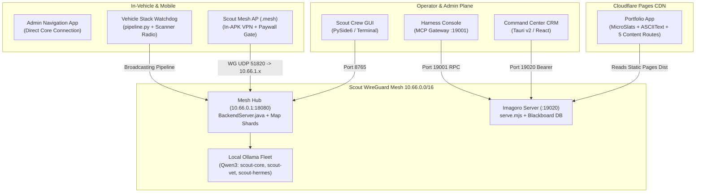
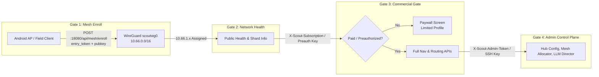

# Unified Master Plan: Scout & Imagoro Integrated Ecosystem

> **Document Version:** 1.0 (Unified Recovery Baseline)  
> **Date:** September 28, 2026  
> **Synthesized From:**  
> - `Scout mesh admin + Android paywall outline.md`  
> - `Scout Mesh_ payment-backed reauthentication and password-protected device keys.md`  
> - `Scout Mesh in-APK VPN.md`  
> - `Production Deployment Plan - Vehicle Stack.md`  
> - `Proprietary server-side Java map engine with 3D client rendering.md`  
> - `PORTFOLIO-CLOUDFLARE.md` (P0–P7, Cloudflare Pages, 3-step demo)  
> - `LANDING-PAGE.md` (L0–L5 privacy, intent bar, modular sidebar)  
> - `P9-local-models-and-warden.md` (Warden sentinel, signed model provenance)  
> - `MIGRATION-REAL-SERVER.md` (Phases A–D real server :19020)  
> - `imagoro-ui/PLAN.md` (Milestones M0–M6, Phase 2 P2-A–P2-H)  

---

## 1. Executive Summary & Vision

The **Scout & Imagoro** ecosystem is a privacy-first, local-first platform combining:
1. **Edge Navigation & Mesh Infrastructure:** A private WireGuard mesh network (`10.66.0.0/16`) connecting in-vehicle sensor stacks, a proprietary Java map/routing engine, and Android devices acting as non-administrative Mesh Access Points (APs).
2. **Local Multi-Agent Intelligence:** A zero-cloud, 100% offline agent orchestration pipeline (`scout_crew`) powered by local Ollama instances executing Apache-2.0-compliant Qwen3 models (excluding Llama weights).
3. **Unified Frontend & Composable CRM:** A modular, React-first application layer (`imagoro-ui`) running across web, desktop, and mobile via substrate-neutral block contracts (`imagoro.image/v1`), backed by an hardened zero-dependency Node server (`serve.mjs` on port `19020`).
4. **Public Broadcast & Product Distribution:** A public portfolio hosted on Cloudflare Pages broadcasting system capabilities and analytics without exposing private infrastructure.



---

## 2. System Architecture & Trust Boundaries

The system enforces **four progressive trust gates** to separate administrative operators from edge client devices:



### Trust Matrix
| Component | Role | Allowed Privileges | Forbidden Actions |
|---|---|---|---|
| **Admin Plane** (Pop!_OS desktop, Hub server, Windows LLM host) | Full System Authority | Mint tokens, reconfigure WireGuard, deploy shards, execute `scout crew`, SSH ops | N/A |
| **Android Access Point** (`dev.warp.stream.mesh`) | Sensor & Nav Edge | Join mesh (`10.66.1.x`), stream GPS/audio, render map tiles, validate license key | Never receives `SCOUT_ADMIN_TOKEN`, hub WG private keys, or SSH credentials |
| **Imagoro Command Center** (`client/apps/command-center`) | CRM & Operator Dashboard | Read real blackboard data, view metrics, trigger P5 publish tool | No direct browser database writes; writes strictly via P5 tool harness |
| **Public Portfolio** (`client/apps/portfolio`) | Static Broadcast | Display published content, interactive UI demonstrations | Zero access to internal mesh or backend database |

---

## 3. Sequential Execution Roadmap

```mermaid
gantt
    title Unified Scout & Imagoro Sequential Execution Roadmap
    dateFormat  YYYY-MM-DD
    axisFormat  %b %d
    
    section Phase 1: Baseline & Security
    WireGuard Mesh Hub & BackendServer     :done, p1_1, 2026-09-01, 2026-09-08
    Block Contract & UI M0-M6             :done, p1_2, 2026-09-08, 2026-09-15
    L0-L5 Privacy & Guardrails            :done, p1_3, 2026-09-15, 2026-09-22
    P9.1 Signed Catalog Provenance Gate    :done, p1_4, 2026-09-18, 2026-09-22
    
    section Phase 2: Agent Intelligence
    Specialist Agentic Tools               :done, p2_1, 2026-09-20, 2026-09-26
    Personal Assistant (PA) Role          :done, p2_2, 2026-09-24, 2026-09-28
    Real Server (:19020) Integration      :done, p2_3, 2026-09-26, 2026-09-28
    Pop!_OS Map Server Setup Suite         :done, p2_4, 2026-09-26, 2026-09-28
    
    section Phase 3: Immediate Targets
    Cloudflare Pages Deploy (Demo Step 1) :active, p3_1, 2026-09-29, 2026-10-04
    Android .mesh Side-by-Side Build      :active, p3_2, 2026-09-29, 2026-10-06
    Preauth Key End-to-End Validation     :p3_3, 2026-10-04, 2026-10-09
    
    section Phase 4: Hub & Multi-Tenancy
    Hosted Hub Deployment (Demo Step 2)   :p4_1, 2026-10-10, 2026-10-17
    Scout Lander Tenant (Demo Step 3)     :p4_2, 2026-10-17, 2026-10-24
    Warden Sentinel Deployment (P9.2-P9.6):p4_3, 2026-10-24, 2026-11-01
```

---

### Phase 1: Foundation & Security Hardening *(COMPLETED & VERIFIED)*
1. **Core Navigation Engine & Mesh Network:**
   - Deployed Java [`BackendServer.java`](file:///c:/Users/gryph/kepler/worktrees/secur-recov-60a92/backend/BackendServer.java) (zero external dependencies, PMTiles tile server, dynamic sharding).
   - Configured WireGuard hub (`scoutwg0` on `10.66.0.1/16`, UDP port `51820`).
   - Hardened IP-based and token-based query validation, CIDR allowlists, and HMAC payment verification.
2. **Qwen3 Lineage Enforcement & Provenance (`P9.1`):**
   - Stripped all Meta Llama weights and aliases across `scout_crew`, `imagoro`, and `routing-scouting-app-to-be-named`.
   - Built single-source Ed25519 signed catalog model provenance gate (`harness/src/model-registry.mjs`).
3. **Privacy Seams & Defensive Encodings (`L0`–`L5`):**
   - Implemented `guard.mjs`: Strict UTF-8 validation (lone surrogate rejection), NFKC-stable ASCII identifiers (homoglyph/confusable block), emoji tag/zero-width/bidi stripping, redacted stable error messages.
   - Built `policy.mjs`: Structured denial codes (`invalid-category`, `invalid-kind`, `invalid-key`, `value-too-large`), token-bound session claims, and per-role capability matrices.
4. **Substrate-Neutral Block Architecture (`M0`–`M6`, `P2-A`–`P2-C`):**
   - Split all 12 UI blocks into React-free `manifest.ts` specifications and re-exported under `@imagoro/image`.
   - Built typed `imagoro.image/v1` assembly manifest plugin for Command Center and `smoke:m7` verifier.
   - Backported core `Broker`, `Gateway`, `Guard`, `Intent`, `Sidebar`, and `Harness Console` from `imagoro/client` into `imagoro-ui`.

---

### Phase 2: Agent Intelligence & Local Routing *(COMPLETED & VERIFIED)*
1. **Sequential Multi-Agent Crew (`scout_crew`):**
   - Sequential, non-hierarchical execution avoiding local LLM recursive loops:  
     `alert` → `intel` → `vet` → `rank` → `core` → `dev` (admin) → `manager` (admin).
   - Strict output contracts per specialist to prevent parser drift.
   - Pinned agentic specialist tools (`specialist_tools.py`) to non-reasoning, temperature 0.
2. **Personal Assistant (`pa` / `scout-hermes-pa300k`):**
   - Defined `scout-hermes-pa300k` Modelfile (300k context, reasoning/thinking enabled, base `qwen3:8b`).
   - Granted full local operator tools (`blackboard_read`, `blackboard_write`, `blackboard_snapshot`).
   - Integrated PA into PySide6 GUI dropdowns, role system prompts, and Ollama environment overrides.
3. **In-Repo Real Server (`serve.mjs` on `:19020`):**
   - Replaced mock fixture replay in Command Center with real server connections to Postgres/blackboard.
   - Replaced dead `:18080` proxy with direct fetch-stream carrying Bearer tokens.
4. **Pop!_OS Map Server Suite:**
   - Shipped `map_server_setup/` (`bootstrap_popos.sh`, `configure_map_server.sh`, `sync_shards.sh`, `verify_map_server.sh`) for rapid deployment of redundant Linux tile servers.

---

### Phase 3: Immediate Deployment & Integration *(CURRENT / NEXT)*

#### Workstream 3.1: Public Portfolio Broadcast (Three-Step Demo: Step 1)
- **Target Repository:** [`imagoro`](file:///c:/Users/gryph/kepler/worktrees/imago-recov-5128b) (`client/apps/portfolio`)
- **Host:** Cloudflare Pages (Free tier, edge TLS, unlimited bandwidth, solves `.dev` HSTS).
- **Deliverables:**
  - Build static dist of portfolio (`pnpm run build` in `client/apps/portfolio`).
  - Deploy 5 content routes (`/`, `/mission`, `/system`, `/services`, `/insights`) styled with `MicroSlats` WebGL backdrop and `ASCIIText`.
  - Validate production deployment script via Wrangler CLI.

#### Workstream 3.2: Non-Admin Android Mesh Client (`.mesh` AP)
- **Target Repository:** [`secure-mesh-navigation`](file:///c:/Users/gryph/kepler/worktrees/secur-recov-60a92) & [`routing-scouting-app-to-be-named`](file:///c:/Users/gryph/kepler/worktrees/routi-recov-2e852)
- **Deliverables:**
  - Configure Gradle product flavor `applicationIdSuffix ".mesh"` (`dev.warp.stream.mesh`) with display label `"Scout Mesh"` to permit side-by-side installation on field test devices.
  - Remove all administrative controls (`SCOUT_ADMIN_TOKEN`, WireGuard private key export, root settings).
  - Embed in-APK WireGuard `VpnService` configured to connect to `97.188.103.160:51820` (`192.168.1.154` LAN fallback).
  - Bind password-encrypted device key vault (Argon2id + AES-GCM + Android Keystore) to mesh enrollment.
  - Wire Paywall UI state machine (`Unregistered` → `Enrolled` → `Subscribed`) with preauthorized testing key bypass (`/api/mobile/validate-key`).

#### Workstream 3.3: Preauthorized Testing Key Verification
- **Target Repositories:** [`routing-scouting-app-to-be-named`](file:///c:/Users/gryph/kepler/worktrees/routi-recov-2e852) & [`secure-mesh-navigation`](file:///c:/Users/gryph/kepler/worktrees/secur-recov-60a92)
- **Deliverables:**
  - Verify `BackendServer.java` accepts `X-Preauthorized-Key` header to bypass network CIDR and endpoint pull restrictions during development.
  - Test preauth key flow in Android `MainActivity.java` paywall prompt without requiring live payment processing.

---

### Phase 4: Hosted Hub, Multi-Tenancy & Warden Sentinel *(HORIZON)*

#### Workstream 4.1: Hosted Command Center Hub (Three-Step Demo: Step 2)
- Host Command Center as the central backend hub accessible over WireGuard mesh.
- Provision per-tenant tokens to allow multiple remote operators to connect their own client services, MCP tools, and local LLMs through Imagoro without sharing databases.

#### Workstream 4.2: Scout Public Site (Three-Step Demo: Step 3)
- Author Scout’s public web property (FAQ, product store, user forums) on its own isolated tenant.
- Manage content, publication, and telemetry strictly using the P5/P6 Imagoro content administration tools.

#### Workstream 4.3: Warden Security Guardian (`P9.2`–`P9.6`)
- Implement **Warden** dev agent sentinel:
  - **Deterministic Guards:** Enforce inference query routing, prevent LLM persona drift, inspect OS network routing tables, and detect unregistered device IDs or suspicious mesh peers.
  - **Advisory Role:** Provides dev recommendations and audit logs but is structurally barred from making autonomous security bypass decisions.

---

## 4. Verification & Quality Gates Summary

Every phase must pass its explicit, automated smoke and integration gates before progression:

| Subsystem | Gate Script / Command | Target Invariant |
|---|---|---|
| **Privacy & Guardrails** | `node scripts/smoke-privacy.mjs` | Well-formed UTF-8, zero-width strip, NFKC ASCII stability, zero `innerHTML` sinks |
| **Tool Policy & Budgets** | `node scripts/smoke-l0.mjs` … `l5.mjs` | Policy digest match, budget bounds, kill-switch disengage, memory isolation |
| **Real Server Migration** | `node scripts/smoke-migrate-a.mjs` | Port `:19020` healthy, SSE fetch-stream alive, Bearer auth validated |
| **Content Publishing** | `node scripts/smoke-p5-publish.mjs` | Image envelope validated, staged, hashed, published flag flipped |
| **Model Provenance** | `node scripts/smoke-p9.mjs` | Ed25519 signature verified, Qwen3 lineage check, Llama models rejected |
| **Assembly Manifest** | `node scripts/smoke-m7.mjs` | Substrate-neutral block contracts verified, manifest hashes match dist |
| **Agent Pipeline** | `scout crew -v` | Sequential execution completes, output contracts valid, no delegation loops |
| **Backend & Routing** | `javac BackendServer.java` | Zero-dependency compilation, security gate filters active |
| **Map Server Setup** | `map_server_setup/verify_map_server.sh` | Remote shards match local hashes, SSH tunneling operational |

---

## 5. Artifact Directory Cross-Reference

| Resource | Path |
|---|---|
| **Master Plan Artifact** | [`unified_master_plan.md`](file:///C:/Users/gryph/.gemini/antigravity-cli/brain/65464a47-6e8c-4383-9b24-e9ab83db3785/unified_master_plan.md) |
| **Recovery Audit Report** | [`recovery_report.md`](file:///C:/Users/gryph/.gemini/antigravity-cli/brain/65464a47-6e8c-4383-9b24-e9ab83db3785/recovery_report.md) |
| **Task Master Plan** | [`MASTER_PLAN.md`](file:///C:/Users/gryph/kepler/tasks/45a9d034-6a3c-476c-a260-d893c64d157e/MASTER_PLAN.md) |
| **Secure Mesh Recovery Tree** | [`secur-recov-60a92/`](file:///c:/Users/gryph/kepler/worktrees/secur-recov-60a92) |
| **Imagoro-UI Recovery Tree** | [`imago-recov-9480c/`](file:///c:/Users/gryph/kepler/worktrees/imago-recov-9480c) |
| **Imagoro Recovery Tree** | [`imago-recov-5128b/`](file:///c:/Users/gryph/kepler/worktrees/imago-recov-5128b) |
| **Routing App Recovery Tree** | [`routi-recov-2e852/`](file:///c:/Users/gryph/kepler/worktrees/routi-recov-2e852) |
| **Scout Crew Recovery Tree** | [`scout-recov-7fd0d/`](file:///c:/Users/gryph/kepler/worktrees/scout-recov-7fd0d) |
