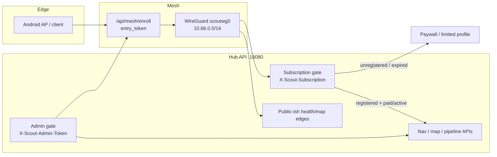
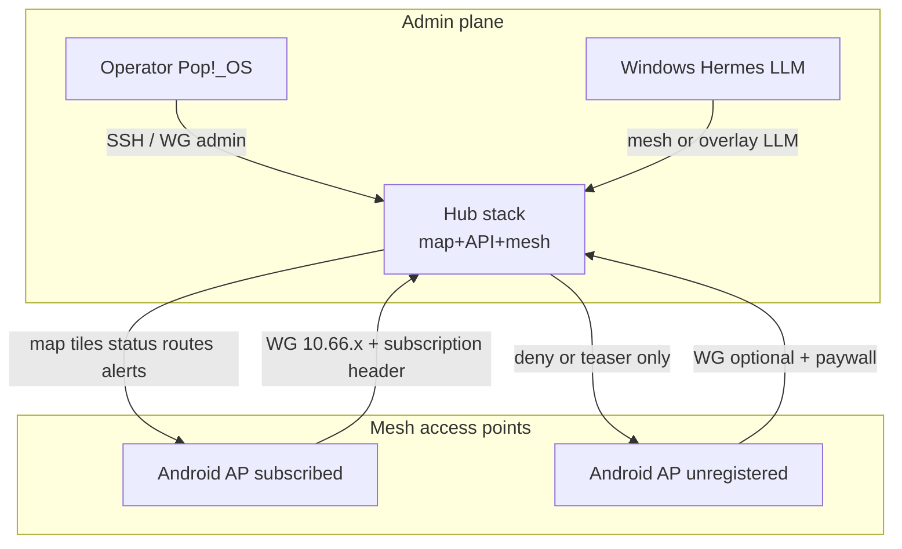

# Scout project outline — mesh admins, Android AP, paywall
Context pack for **Kepler / OpenCode / Obsidian**\. Describes how the Scout navigation system is administered, how the WireGuard mesh works, how Android clients act as mesh access points, and how unregistered Android clients stay behind a paywall while three machines remain admin\-level\.
## 1\. One\-sentence product model
Scout is a **local\-first navigation \+ scanner\-intel stack**: a small set of **admin machines** own the hub, map/API, and crew/LLM control plane; **Android \(and other\) clients** join only as **mesh endpoints / access points** for the driver UI and sensors — they do **not** become administrators unless explicitly elevated, and **unregistered** Android clients are limited by subscription/paywall gates even after they can touch the mesh enroll edge\.
## 2\. Live topology \(current\)
### 2\.1 Admin\-level machines \(three active\)
These are the **admin plane**\. They may hold mesh keys, hub state, stack processes, SSH, and `X-Scout-Admin-Token` / operator secrets\.
| Role | Host \(typical\) | Network identity | Admin capabilities |
|\-\-\-\-\-\-|\-\-\-\-\-\-\-\-\-\-\-\-\-\-\-\-|\-\-\-\-\-\-\-\-\-\-\-\-\-\-\-\-\-\-|\-\-\-\-\-\-\-\-\-\-\-\-\-\-\-\-\-\-\-\-|
| **Mesh hub \+ vehicle/map stack** | peer Linux `scout-stack` | LAN `192.168.1.154`; WG hub `10.66.0.1/32` on `scoutwg0`; API `:18080` | Runs Java backend, map shards, mesh enroll, peer allocator, `apply_peers.sh`, WG listen `:51820` |
| **Operator workstation \(this Pop\!\_OS\)** | local desktop | LAN `192.168.1.155`; WG client `10.66.2.3/32` \(`popos-client-155`\); optional Tailscale | SSH ops, enroll as Linux peer, CrewAI/scout\_crew tooling, docs/PRs, admin token use |
| **Windows Hermes / Ollama peer** | `gibdowsvista` \(when online\) | Historical Tailscale `100.82.130.47`; mesh\-adjacent LLM host | Serves manager/hermes models; operator admin for model routing — **not** a public client |
**Admin definition:** can \(a\) hold or mint **entry/admin tokens**, \(b\) change hub WireGuard peer set, \(c\) run or reconfigure backend/stack, \(d\) bypass or set subscription policy, \(e\) SSH to hub/peers with operator keys \(`id_ed25519_popos`\)\.
### 2\.2 Non\-admin mesh participants
| Kind | Examples | Mesh addresses | Role |
|\-\-\-\-\-\-|\-\-\-\-\-\-\-\-\-\-|\-\-\-\-\-\-\-\-\-\-\-\-\-\-\-\-|\-\-\-\-\-\-|
| Android verify / e2e peers | `android-verify-pixel-test1`, `android-netns-e2e-1` | `10.66.1.2/32`, `10.66.1.3/32` | **Mesh access points** for navigation UI, GPS, optional audio/scanner edge — **not** admin |
| Probe / ephemeral Linux | `probe-test` | `10.66.2.2/32` | Test enrollment only |
### 2\.3 Overlay network
* **CIDR:** `10.66.0.0/16`
* **Hub:** `10.66.0.1` \(`scoutwg0`\)
* **Client range pattern:** `10.66.1.x` Android\-ish; `10.66.2.x` Linux peers \(allocator\-driven\)
* **Enroll \(pre\-mesh\):** `POST http://<hub-lan-or-public>:18080/api/mesh/enroll` with JSON `entry_token` \+ `device_id` \+ `platform`
* **Post\-join backend base:** `http://10.66.0.1:18080`
* **Public UDP endpoint \(hub\):** `97.188.103.160:51820` \(LAN path preferred when on same Wi‑Fi: `192.168.1.154:51820`\)
* **Hub WG public key \(current\):** `54Jb4ewbk6ahx5z0oUpR/L3fsnVxEBZam1G1hxBEfgo=`
Hub must keep route `10.66.0.0/16 dev scoutwg0` \(persisted via `PostUp` on hub conf\) or handshakes succeed while ICMP/HTTP fail\.
## 3\. Trust layers \(how admin works without giving Android the keys to the kingdom\)
Think in **four gates**\. Android can pass early gates and still fail later ones\.

### 3\.1 Gate A — Physical / network reachability
Client must reach hub **without** mesh for first enroll \(LAN or public IP:port\)\. Mesh UDP `51820` must work after join\.
### 3\.2 Gate B — Mesh enrollment \(`entry_token`\)
* Header/body field: **`entry_token`** must equal hub env `SCOUT_MESH_ENTRY_TOKEN`\.
* Success returns: client WG private key, hub public key, assigned `client_address`, endpoint, `allowed_ips` \(`10.66.0.0/16`\), `backend_base_url`, interface name `scoutwg0`\.
* Hub writes `stack/mesh/peers/<device_id>.conf` and allocator row; operator runs **`apply_peers.sh`** so live `wg` includes the peer\.
* **Enrollment ≠ admin\.** It only allocates a tunnel identity\.
### 3\.3 Gate C — Subscription / paywall \(Android product gate\)
* Response profile advertises subscription metadata, e\.g\. header **`X-Scout-Subscription`**\.
* Runtime flag today: `SCOUT_SUBSCRIPTION_REQUIRED` \(hub `runtime.env`; may be `false` in dev\)\.
* **Product rule for unregistered Android clients:**
    * May complete mesh enroll **only** with a valid **entry** token \(operator\-controlled, rotatable\)\.
    * After join, **stack navigation APIs** that drive the paid product require an **active subscription token** \(or equivalent account binding\)\.
    * Missing/invalid/expired subscription → **paywall**: limited or denied nav/map/pipeline features; client remains a dumb AP candidate, not an operator\.
    * Unregistered devices must **not** receive `SCOUT_ADMIN_TOKEN`, hub private key, peer directory write access, or SSH admin keys\.
### 3\.4 Gate D — Administration
* Admin auth via **`SCOUT_ADMIN_TOKEN`** and header **`X-Scout-Admin-Token`** \(`ScoutAdminAuth` / backend\)\.
* Admin plane actions: mesh policy, peer apply, stack restart, jurisdiction/map shard control, CrewAI/blackboard, model routing, token rotation\.
* **Only the three admin machines** \(and humans on them\) should store admin token \+ hub private key \+ SSH operator key\.
## 4\. Android clients as mesh access points \(not admins\)
### 4\.1 Intended role
Each Android install is a **navigation access point** on the mesh:
* Terminates WG as a `/32` peer under `10.66.0.0/16`\.
* Points app API base at **`http://10.66.0.1:18080`** \(or advertise host from `/api/map/status` → `network.urls`\)\.
* Provides **driver UX**: map, route, alerts, optional mic/GPS/sensor uplink into the hub pipeline\.
* Can go offline; hub retains authority over map shards, channels, and crew synthesis\.
### 4\.2 Explicit non\-roles
Android APs do **not**:
* Run the Java vehicle stack or mutate hub `stack/mesh/state`\.
* Hold hub WG private key or `apply_peers` rights\.
* Call admin\-only APIs without admin token \(should hard\-fail\)\.
* Expand paywall by sharing subscription tokens across unregistered devices \(treat tokens as device\-bound where possible\)\.
### 4\.3 Enrollment path \(peer\_setup\)
On hub repo: `stack/mesh/peer_setup/` \(`bootstrap_peer.sh`, `join_mesh.sh`, `verify_peer.sh`, bundles\)\.
Typical Android/Linux peer flow:
1. Reach hub pre\-mesh HTTP\.
2. `POST /api/mesh/enroll` with `entry_token`, `device_id`, `platform`\.
3. Write local `scoutwg0` conf; `wg-quick up`\.
4. Hub `apply_peers.sh`\.
5. Verify handshake \+ `ping 10.66.0.1` \+ `GET /api/health`\.
6. App presents paywall until subscription validated; then full nav APIs\.
## 5\. Paywall behavior \(product rules for implementers\)
### 5\.1 Unregistered Android
| Capability | Allowed? |
|\-\-\-\-\-\-\-\-\-\-\-\-|\-\-\-\-\-\-\-\-\-\-|
| Discover public marketing / install | Yes |
| Mesh enroll with **entry** token | Only if operator issues entry token |
| WG tunnel up | Yes after enroll |
| `GET /api/health` / limited profile | Yes \(diagnostics\) |
| Full map/nav/pipeline/mobile bootstrap | **No** without active subscription |
| Admin token APIs / peer apply / SSH | **No** |
| Act as mesh AP for a **registered** account | Yes after paywall cleared |
### 5\.2 Registered \+ subscribed Android
* Full client nav feature set over mesh\.
* Still **not** admin unless separately elevated \(should be rare; prefer admin only on the three machines\)\.
### 5\.3 Reinforcement mechanisms \(keep all three\)
1. **Secret separation:** entry token ≠ subscription token ≠ admin token\.
2. **Server\-side enforcement:** every sensitive route checks subscription \(and admin where needed\); never trust client flags alone\.
3. **Mesh is transport only:** `10.66.0.0/16` reachability does not imply paid entitlement\.
4. **Allocator \+ peer files are hub\-owned:** devices cannot mint new peers without enroll \+ hub apply\.
5. **Rotate entry token** after ops windows so abandoned APKs cannot quietly re\-join forever\.
## 6\. Admin machine responsibilities \(checklist\)
### Hub Linux \(`10.66.0.1` / `192.168.1.154`\)
* `wg-quick@scoutwg0` enabled; UDP `51820` open as intended\.
* Backend `:18080` with `SCOUT_MESH_*` \+ tokens in process env\.
* `stack/mesh/{state,peers}`; run `apply_peers.sh` after enroll\.
* Ensure `PostUp` route `10.66.0.0/16 dev scoutwg0`\.
* Vehicle stack: map planet/shards AZ alpha, pipeline, frontend advertise host\.
### Operator Pop\!\_OS \(`10.66.2.3` / `192.168.1.155`\)
* `wg-quick@scoutwg0` client to hub; SSH `scout-stack` / `scout-stack-wg`\.
* `~/.ssh` operator key `id_ed25519_popos`; GitHub key separate\.
* Optional: `scout_crew` split\-mesh LLM routing; docs/PRs\.
* Holds admin token only in operator secret store — not in Android builds\.
### Windows Hermes \(when online\)
* Ollama/Hermes for manager reasoning; pinned via operator env \(`SCOUT_PEER_*` / host overrides\)\.
* Admin for model serving; not a consumer paywall client\.
## 7\. Data flow \(nav system\)

Pipeline/scanner and map shard authority stay on hub \(and operator\-controlled hosts\)\. Android APs **consume and contribute edge context**; they do not own the system of record\.
## 8\. Security / ops notes for agents
* Do **not** commit real `SCOUT_ADMIN_TOKEN`, entry tokens, or WG private keys into git or Obsidian vaults; reference **names** and locations \(`stack/mesh/state/`, `~/.config/scout-mesh/`\)\.
* Dev may set `SCOUT_SUBSCRIPTION_REQUIRED=false`; production outline assumes **paywall enforced** for Android\.
* Prefer LAN WG endpoint on home Wi‑Fi; keep public endpoint for field APs\.
* After reboot: verify hub route \+ `wg show` handshakes \+ `curl http://10.66.0.1:18080/api/health`\.
* Stale Tailscale nodes are legacy overlay; **WireGuard `10.66.0.0/16` is the Scout mesh of record** for nav APs\.
## 9\. Repo / path map \(agents\)
| Path | Purpose |
|\-\-\-\-\-\-|\-\-\-\-\-\-\-\-\-|
| `stack/mesh/` | Hub install, `apply_peers.sh`, `status.sh`, state, peers |
| `stack/mesh/peer_setup/` | Join/bootstrap/verify bundles for peers |
| `navigation/backend/` | `BackendServer`, `ScoutMeshControl`, `ScoutAdminAuth` |
| `stack/config/vehicle_stack.env` | Ports, advertise host, AZ scope |
| `scout_crew/` \(separate repo\) | CrewAI / Ollama operator tooling |
| `docs/guides/PEER_MESH_DEPLOYMENT.md` | Operator runbook \(may lag WG\-first topology\) |
| Local client state | `~/.config/scout-mesh/`, `/etc/wireguard/scoutwg0.conf` |
## 10\. Implementation backlog \(outline only\)
1. Enforce subscription on all paid Android API routes when `SCOUT_SUBSCRIPTION_REQUIRED=true`\.
2. Device\-bind subscription tokens; revoke on mesh peer removal\.
3. Admin\-only endpoints strictly behind `X-Scout-Admin-Token`\.
4. Document rotate procedure for entry \+ admin tokens\.
5. Android app: mesh join UX → paywall UX → full nav UX state machine\.
6. Keep three admin machines as sole holders of hub private key \+ admin token \+ SSH operator key\.
7. Obsidian: link this outline as MOC; Kepler/OpenCode: use sections 3–5 as policy invariants when editing backend or Android clients\.
## 11\. Invariants \(do not break\)
1. **Mesh transport ≠ entitlement\.**
2. **Three admin machines** own control plane; Android APs are edge\.
3. **Unregistered Android** never gets admin capabilities and hits **paywall** on paid nav features\.
4. **Hub allocates** WG IPs and peer list; clients cannot self\-authorize new peers into the hub conf without enroll \+ apply\.
5. **Secrets stay off clients** that are not admin machines\.
